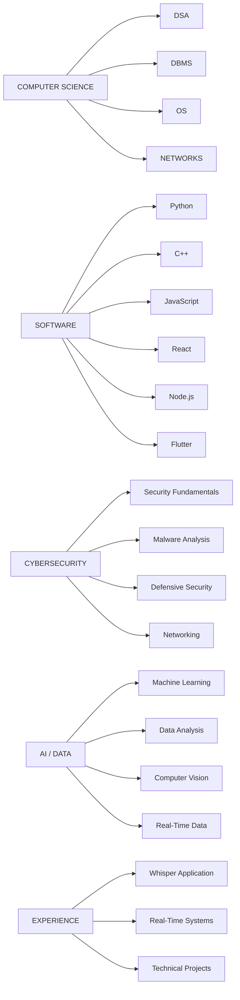

<div align="center">


<br/><br/>

<a href="https://github.com/Niranjjith">

</a>
<a href="https://www.linkedin.com/in/niranjan-a-r-674799281/">

</a>
<a href="https://arjith.vercel.app/">

</a>

</div>

---

## `01 / WHO AM I?`

<table>
<tr>
<td width="65%" valign="top">

### **Computer Science Student · Builder · Security Enthusiast**

<p align="justify">

I like understanding <b>how systems work</b> and then turning that understanding into something usable.

My interests sit at the intersection of <b>software engineering, cybersecurity, AI/ML and computer science fundamentals</b>. I learn primarily by building projects, solving problems, debugging failures and understanding why things work.

My long-term focus is to develop strong fundamentals and use them to <b>build, analyze and secure real-world systems</b>.

</p>

</td>

<td width="35%" valign="top">

### 🎯 FOCUS

```text
Software
Cybersecurity
AI / ML
Data Structures
Systems
Problem Solving
```

### 📍 CURRENTLY

```text
Learning
Building
Experimenting
Improving
```

</td>
</tr>
</table>

---

## `02 / CURRENT DIRECTION`

<table>
<tr>

<td width="33%" valign="top">

### 💻 SOFTWARE

```text
Web Development
Backend Systems
REST APIs
Mobile Applications
Full-Stack Projects
```

**Focus**

`React` `Node.js` `Flutter` `MongoDB`

</td>

<td width="33%" valign="top">

### 🔐 SECURITY

```text
Cybersecurity
Malware Analysis
Threat Analysis
Defensive Security
Security Research
```

**Focus**

`Python` `Linux` `Networking`

</td>

<td width="33%" valign="top">

### 🤖 AI / DATA

```text
Machine Learning
Data Analysis
Computer Vision
Intelligent Systems
ML-assisted Security
```

**Focus**

`Python` `TensorFlow` `OpenCV`

</td>

</tr>
</table>

---

## `03 / TECH STACK`

<table>
<tr>
<td width="50%" valign="top">

### Languages


### Core Computer Science

`DSA`  
`OOP`  
`DBMS`  
`Operating Systems`  
`Computer Networks`

</td>

<td width="50%" valign="top">

### Frameworks · Databases · Tools


### AI · Data · Security


</td>
</tr>
</table>

---

## `04 / PROJECT LAB`

<p align="justify">

These projects represent different areas I am exploring — from civic technology and full-stack development to cybersecurity, machine learning and data analysis.

</p>

<table>
<tr>
<td width="50%" valign="top">

### 🌿 01 — Smart Wayanad

**Civic Technology · Flutter · React · Node.js · MongoDB**

<p align="justify">

A connected civic platform designed around useful district-level services, emergency support and real-time information.

</p>

`SOS` `Healthcare` `Transport`  
`Disaster Readiness` `Location Services`  
`Admin Dashboard` `Real-time Updates`

```text
Flutter
   ↓
Node / Express
   ↓
MongoDB
   ↓
React Dashboard
   ↓
Socket.IO
```

<a href="https://github.com/Niranjjith/Smart-Wayanad">

</a>

</td>

<td width="50%" valign="top">

### 🛡️ 02 — ML-Assisted Malware Triage

**Cybersecurity · Machine Learning · Python**

<p align="justify">

A defensive security project exploring how machine learning can assist the initial triage of suspicious files.

</p>

`Feature Extraction`  
`Classification`  
`Automated Analysis`  
`Malware Triage`  
`Security Research`

```text
Suspicious File
      ↓
Feature Extraction
      ↓
ML Analysis
      ↓
Triage Result
      ↓
Analyst Review
```

<a href="https://github.com/Niranjjith/ML-Assisted-Malware-Triage-System">

</a>

</td>
</tr>

<tr>

<td width="50%" valign="top">

### 🚀 03 — Nexs-Hub

**Student Innovation · Web Platform · Collaboration**

<p align="justify">

A student-focused ecosystem designed to move ideas from brainstorming toward collaboration, project building and execution.

</p>

`Ideas` `Collaboration`  
`Student Innovation`  
`Project Building`  
`Execution`

```text
IDEA
 ↓
DISCOVER
 ↓
COLLABORATE
 ↓
BUILD
 ↓
LAUNCH
```

<a href="https://github.com/Niranjjith/Nexs-Hub">

</a>

</td>

<td width="50%" valign="top">

### 🎓 04 — Student Performance Coach

**Python · Data Analysis · Education Technology**

<p align="justify">

A data-driven project for understanding student performance, tracking progress and surfacing useful insights.

</p>

`Performance Analysis`  
`Progress Tracking`  
`Data Insights`  
`Learning Support`

```text
Student Data
     ↓
Analysis
     ↓
Performance Signals
     ↓
Progress Tracking
     ↓
Better Decisions
```

<a href="https://github.com/Niranjjith/Student-Performance-Coach">

</a>

</td>

</tr>
</table>

<br/>

<div align="center">

<a href="https://github.com/Niranjjith?tab=repositories">

</a>

</div>

---

## `05 / LEARNING RADAR`

<table>
<tr>

<td width="33%" valign="top">

### 🔐 SECURITY

**Learning**

`Cybersecurity`

`Malware Analysis`

`Defensive Security`

`Security Research`

</td>

<td width="33%" valign="top">

### 🧠 COMPUTER SCIENCE

**Strengthening**

`Data Structures`

`Algorithms`

`DBMS`

`Operating Systems`

`Networks`

</td>

<td width="33%" valign="top">

### 🤖 INTELLIGENT SYSTEMS

**Exploring**

`AI / ML`

`Data Analysis`

`Computer Vision`

`Intelligent Systems`

</td>

</tr>
</table>

<br/>


---

## `06 / EDUCATION & CERTIFICATIONS`

<table>
<tr>
<td width="50%" valign="top">

### 🎓 EDUCATION

**M.Sc. Computer Science**  
Nilgiri College (Autonomous)

**B.Sc. Multimedia & Web Technology**  
Nilgiri College  
*Affiliated with Bharathiar University*

**Diploma in AI & Robotics**

</td>

<td width="50%" valign="top">

### 📜 CERTIFICATIONS

**OCSP — Offensive Cyber Security Professional**  
Offenso Hackers Academy

**Areas of Interest**

`Cybersecurity` `AI / ML`  
`Web Development` `Networking`  
`Data Analysis` `System Security`

</td>
</tr>
</table>

---

## `07 / INTERNSHIP & EXPERIENCE`

<table>
<tr>

<td width="50%" valign="top">

### 🏛️ HIGH COURT OF KERALA

**IT Department · Internship**

Worked with the IT Department on practical software and technology-related activities, gaining exposure to real-world IT operations and application development.

### 🎙️ WHISPER APPLICATION

Worked with a **Whisper-based application**, exploring practical application development and integration of speech-related technology.

</td>

<td width="50%" valign="top">

### 🔭 TIFR OOTY

**Real-Time Data & Visualization**

Worked with **real-time data**, focusing on handling, processing and presenting continuously changing information.

```text
REAL-TIME DATA
      ↓
DATA PROCESSING
      ↓
LIVE VALUES
      ↓
GRAPH / VISUALIZATION
      ↓
DATA INSIGHTS
```

</td>

</tr>
</table>

---

## `08 / SKILL MAP`



---

---

<div align="center">

`BUILD SOMETHING USEFUL.`

<br/><br/>


</div>
